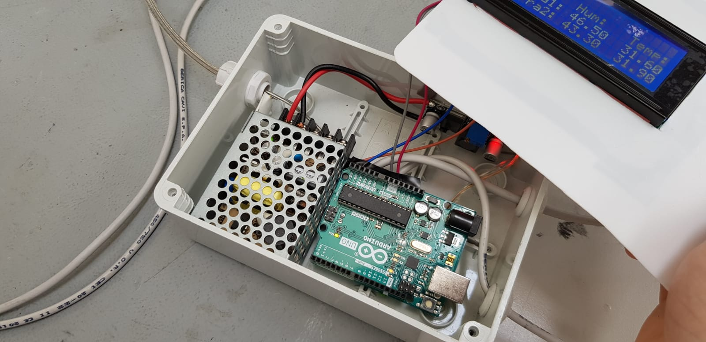
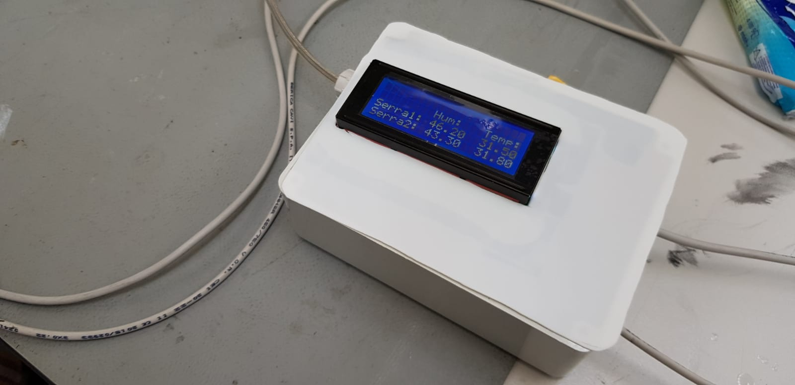

**Autori**:Marco Speranza, Max Leon Carlesi, Filippo Ferretto

**Azienda**: [Fanlab Vr](https://www.veronafablab.it/), [Hangar](http://www.hangar-lab.com/)

# visualizzatore_dati_dht22
---
#### versione: 01_01  19/06/2019
##  Obbitivo: 
In questo progetto dobbiamo visualizzare i dati di 2 sensori in uno schermo con arduino. Successivamente questo progetto dovra essere applicato in una serra.
##  Materiale usato:
* [Ide arduino](https://www.arduino.cc/en/Main/Software)
* [libreria_liquidcristal](https://bitbucket.org/fmalpartida/new-liquidcrystal/wiki/Home)
* Arduino Uno
* 2 DHT22
* [Schermo LCD I2C 20 x 4](https://www.amazon.it/AZDelivery-HD44780-Interfaccia-Caratteri-Gratuito/dp/B07N8CGM9G/ref=sr_1_1_sspa?keywords=lcd+20x4+i2c&qid=1561016672&s=gateway&sr=8-1-spons&psc=1)
* Saldatrice
* Altri Materiali
##  Descrizione:
Per scrivere il codice abbiamo diviso il lavoro in dui parti che consisteva nel creare/trovare prima il codice per scrivere sullo schermo e per prendere i dati dal sensore per poi mettere tutto insieme e creare il prodotto finale. Successivamente era una questione di saldare e inserire in un scatola.

#####	Schermo
Per scrivere sullo schemro abbiamo usato questo codice iniziale:

```cpp
// www.giuseppecaccavale.it
 
#include <Wire.h>
#include <LiquidCrystal_I2C.h>
 
LiquidCrystal_I2C lcd(0x27, 2, 1, 0, 4, 5, 6, 7, 3, POSITIVE);  // Set the LCD I2C address
 
 
void setup() 
{
  lcd.begin(20,4); 
  lcd.backlight();
}
 
 
void loop()
{
  lcd.setCursor(2,0);
  lcd.print("Ciao Ragazzi");
  lcd.setCursor(6,1);
  lcd.print("(GC)");
}
```
##### DHT22:
Per il codice del dht per leggere le informazioni abbiamo usato questo :

```cpp


#include "DHT.h"

#define DHTPIN 2     // Digital pin connected to the DHT sensor
#define DHTTYPE DHT22   // DHT 22  (AM2302), AM2321

DHT dht(DHTPIN, DHTTYPE);

void setup() {
  Serial.begin(9600);
  Serial.println(F("DHTxx test!"));

  dht.begin();
}

void loop() {
  
  delay(2000);

  
  float h = dht.readHumidity();
  float t = dht.readTemperature();  
  float f = dht.readTemperature(true);

  
  if (isnan(h) || isnan(t) || isnan(f)) {
    Serial.println(F("Failed to read from DHT sensor!"));
    return;
  }

 
  float hif = dht.computeHeatIndex(f, h);  
  float hic = dht.computeHeatIndex(t, h, false);

  Serial.print(F("Humidity: "));
  Serial.print(h);
  Serial.print(F("%  Temperature: "));
  Serial.print(t);
  Serial.print(F("°C "));
  Serial.print(f);
  Serial.print(F("°F  Heat index: "));
  Serial.print(hic);
  Serial.print(F("°C "));
  Serial.print(hif);
  Serial.println(F("°F"));
}


```


Per poter vedere il codice completo si guardi il codice all'interno dell cartella visualizzatore_dati. Dopo aver saldato come ultimo passaggio sarebbe quello di inserire il tutto all'interno della scatola per poi essere usato effettivamente nella realta.

### Fonti:
* https://github.com/adafruit/DHT-sensor-library/blob/master/examples/DHTtester/DHTtester.ino
* https://howtomechatronics.com/tutorials/arduino/dht11-dht22-sensors-temperature-and-humidity-tutorial-using-arduino/
* http://www.techydiy.org/how-to-connect-an-i2c-lcd-display-to-an-arduino-uno/
* http://www.brescianet.com/appunti/Elettronica/Arduino/corso/Esempio_DISPLAYLCD2.htm
* https://www.youtube.com/watch?v=ze_PKgCJoVM
* https://create.arduino.cc/projecthub/mafzal/temperature-monitoring-with-dht22-arduino-15b013
